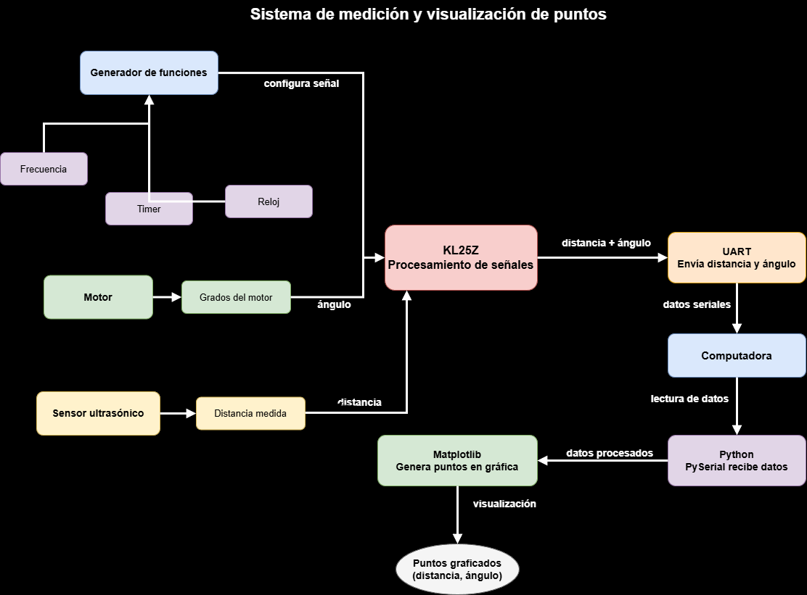

# SoC Project: Mini Radar System with KL25Z  
Joshua Menchaca - Santiago Benavent - Jared García - André Pinto  

This project implements a **radar-like embedded system** using the KL25Z microcontroller, combining **motor control, ultrasonic sensing, and UART communication**.

The system performs an **angular sweep**, measures distances, and sends the data to a computer for visualization.

---

## Materials Used

- Microcontroller: KL25Z  
- Ultrasonic Sensor (HC-SR04)  
- Stepper Motor  
- Driver L293D  
- UART Communication (PC)  
- Breadboard and jumper wires  

---

# 🔹 SYSTEM OVERVIEW: Radar Operation

## Description

This system simulates a **basic radar** by integrating:

- A **stepper motor** for angular movement  
- An **ultrasonic sensor** for distance measurement  
- **UART communication** for data transmission  

---

## System Behavior

- The motor performs a **sweep from 0° to 180° and back**  
- Every few steps:
  - The system measures distance  
  - Associates it with the current angle  
  - Sends the data to the PC  

---

## Key Concepts

- GPIO control  
- Stepper motor sequencing  
- Ultrasonic distance measurement  
- UART communication  
- Timing control using delays  

---

## Execution Flow

### Main Loop
- Move stepper motor one step  
- Increment internal step counter  
- Every 4 steps:
  - Measure distance  
  - Send `(angle, distance)` via UART  

---

# 🔹 PART 1: UART Communication

## Description

This part handles **data transmission from the KL25Z to a computer** using UART.

---

## System Behavior

- UART operates in **TX mode only**  
- Baud rate: **57600**  
- Data format:

```
angle,distance
```

### Example

```
45,120
90,85
135,200
```

---

## Key Concepts

- UART initialization  
- Baud rate configuration  
- Serial data transmission  
- String formatting using `sprintf`  

---

## Execution Flow

### Initialization
- Enable UART0 clock  
- Configure PTA2 as TX  
- Set baud rate  

### Data Transmission
- Convert values to string  
- Send character by character  

---

# 🔹 PART 2: Stepper Motor Control

## Description

This part controls the **angular movement** using a stepper motor connected to PORTD.

---

## System Behavior

- Motor rotates step-by-step using a sequence  
- Performs a full sweep:
  - Forward (0° → 180°)  
  - Backward (180° → 0°)  

---

## Key Concepts

- Stepper motor sequencing  
- Direction control  
- Position tracking  
- GPIO outputs  

---

## Execution Flow

### Motor Initialization
- Configure PTD0–PTD3 as outputs  

### Step Sequence
- Activate coils in order:

```
0x01 → 0x02 → 0x04 → 0x08
```

### Angle Calculation

```c
angle = (steps * 180) / 1024;
```

---

# 🔹 PART 3: Ultrasonic Sensor Measurement

## Description

This part measures the **distance to objects** using an ultrasonic sensor.

---

## System Behavior

- Send trigger pulse (10 µs)  
- Wait for echo signal  
- Measure duration of echo  
- Convert time to distance  

---

## Key Concepts

- Pulse generation  
- Signal timing  
- Distance calculation  
- Timeout handling  

---

## Execution Flow

### Measurement Steps
- Set TRIG HIGH for 10 µs  
- Wait for ECHO to go HIGH  
- Measure time while ECHO is HIGH  

### Distance Calculation

```c
distance = (time * 0.0343) / 2;
```

---

# 🔹 PART 4: System Integration

## Description

All subsystems are combined to create a **functional radar system**.

---

## System Features

- Continuous angular scanning  
- Periodic distance measurement  
- Real-time UART data output  
- Efficient balance between speed and measurement  

---

## System Behavior

- The motor runs continuously  
- Distance is not measured at every step to avoid delays  
- Measurement occurs every 4 steps  

---

## Key Concepts

- System optimization  
- Task scheduling  
- Embedded system integration  

---

## Execution Flow

### Initialization
- Initialize UART  
- Initialize ultrasonic sensor  
- Initialize motor  

### Main Loop
- Step motor  
- Every 4 steps:
  - Measure distance  
  - Send data  

---

## Overall System Behavior

| Component | Function |
|----------|----------|
| Stepper Motor | Controls angular sweep |
| Ultrasonic Sensor | Measures distance |
| UART | Sends data to PC |
| KL25Z | Central control |

---

## 📊 Visualization

The transmitted data can be visualized using:

- Python (recommended)  
- MATLAB  
- Other plotting tools  

### Goal
Represent the radar in **polar or Cartesian coordinates**

---

## Final Insight

This project demonstrates how an embedded system can integrate:

- Motor control for movement  
- Sensors for data acquisition  
- Communication for visualization  

It highlights the importance of balancing:

- Timing  
- Processing  
- Hardware interaction  

to build a **real-time embedded application** similar to a radar system.

---
---

# 🔹 CONNECTION DIAGRAM

## Description

The following table shows the **hardware connections** between the KL25Z microcontroller and all components used in the radar system.

---

## 📡 Ultrasonic Sensor (HC-SR04 → KL25Z)

| Sensor Pin | KL25Z Pin | Description |
|-----------|----------|------------|
| VCC | 5V | Power supply |
| GND | GND | Ground |
| TRIG | PTB0 | Trigger signal (output) |
| ECHO | PTB1 | Echo signal (input) |

---

## 🌀 Stepper Motor (via L293D Driver → KL25Z)

| L293D Input | KL25Z Pin | Function |
|------------|----------|---------|
| IN1 | PTD0 | Coil A |
| IN2 | PTD1 | Coil B |
| IN3 | PTD2 | Coil C |
| IN4 | PTD3 | Coil D |

### L293D Power Connections

| Pin | Connection |
|-----|-----------|
| VCC1 | 5V |
| VCC2 | External motor supply |
| GND | GND |

---

## 📤 UART Communication (KL25Z → PC)

| Signal | KL25Z Pin | Description |
|--------|----------|------------|
| TX | PTA2 | Serial transmission |
| GND | GND | Common ground |

---

## 🔌 System Overview (Simplified)

```
KL25Z
│
├── Ultrasonic Sensor (HC-SR04)
│   ├── TRIG → PTB0
│   └── ECHO → PTB1
│
├── L293D Driver
│   ├── IN1 → PTD0
│   ├── IN2 → PTD1
│   ├── IN3 → PTD2
│   └── IN4 → PTD3
│
└── UART
    └── TX → PTA2 → PC
```

---

##  Notes

- Make sure all components share a **common ground**
- The ultrasonic sensor may require **5V logic level considerations**
- The motor should use an **external power supply via L293D**
- Avoid powering the motor directly from the KL25Z

---

## Diagrama de flujo


