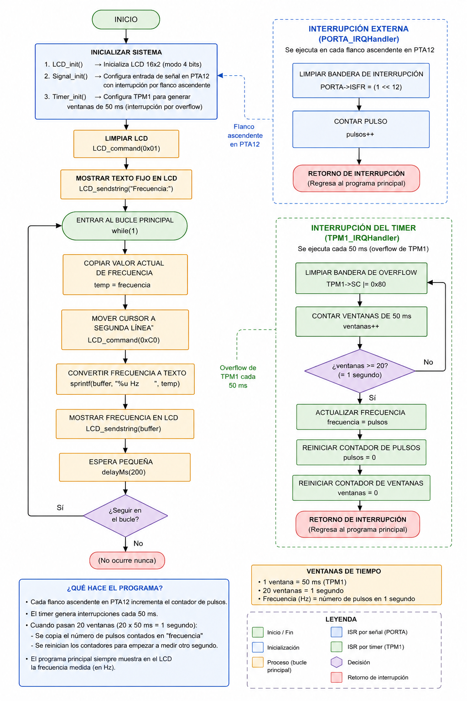
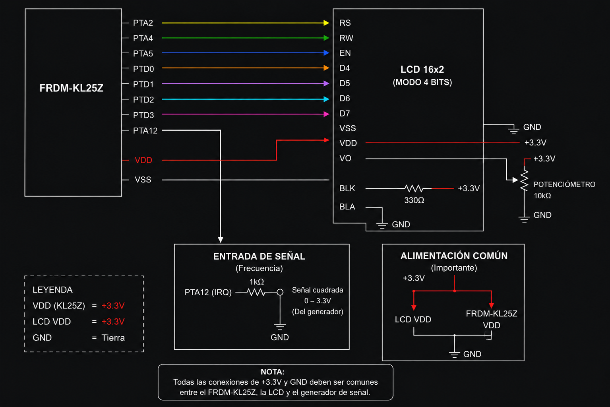

# SoC Practice: Frequency Meter using Timers, Interrupts and LCD  
Andre - Santi - Jared - Joshua
This project consists of the design and implementation of a digital frequency meter using the KL25Z microcontroller.

The system measures the frequency of an external signal generated by a signal generator, counts the incoming pulses using hardware interrupts, and displays the measured frequency on a 16x2 LCD operating in 4-bit mode.

The project combines:
- GPIO interrupts
- Timer modules (TPM1)
- LCD interfacing
- Real-time pulse counting

to create a complete embedded measurement system.

---

# Materials Used

- Microcontroller: FRDM-KL25Z
- LCD 16x2 (4-bit mode)
- Signal Generator
- Breadboard and jumper wires
- Potentiometer (10kΩ for LCD contrast)
- Resistor for LCD backlight

---

# Project Objective

The objective of this practice is to design and build a frequency meter capable of:

- Measuring the frequency of an external signal
- Counting pulses accurately using interrupts
- Using timers to define a measurement window
- Displaying the measured frequency on an LCD
- Achieving stable measurements with low error

---

# System Description

The signal generated externally is connected to:

```text
PTA12
```

Each rising edge generates an interrupt, and the system increments a pulse counter.

A timer module (TPM1) creates periodic time windows of approximately:

```text
50 ms
```

After:

```text
20 windows = 1 second
```

the total pulse count is interpreted directly as the frequency in Hertz.

# Signal Input

| Signal | KL25Z Pin |
|---|---|
| External Signal Input | PTA12 |

---

# System Behavior

- The LCD initializes in 4-bit mode
- The system continuously waits for pulses on PTA12
- Each rising edge increments a pulse counter
- TPM1 generates periodic interrupts every ~50 ms
- After 20 timer windows:
  - Frequency is updated
  - Pulse counter resets
  - LCD displays the new frequency

---

# Key Concepts

- GPIO interrupts
- Timer interrupts (TPM1)
- Frequency measurement using pulse counting
- LCD communication in 4-bit mode
- Embedded real-time systems

---

# Timer Configuration

The TPM1 timer was configured using:

```c
TPM1->MOD = 8192 - 1;
```

with:
- Prescaler = 128
- TPM clock enabled through `SIM->SOPT2`

This creates a timing window close to:

```text
50 ms
```

The system accumulates:

```text
20 timer overflows
```

to obtain an effective measurement window of:

```text
1 second
```

---

# Frequency Measurement Principle

The frequency is calculated using:

```text
f = N / T
```

Where:
- N = number of detected pulses
- T = measurement time

Since the system measures during approximately:

```text
T = 1 second
```

then:

```text
f = N
```

Meaning:
- the number of pulses counted in one second is directly equal to the frequency in Hertz.

---

# Interrupt System

## PORTA Interrupt (Signal Detection)

### ISR:
```c
PORTA_IRQHandler()
```

Function:
- Detects rising edges on PTA12
- Increments pulse counter

---

## TPM1 Interrupt (Timing Window)

### ISR:
```c
TPM1_IRQHandler()
```

Function:
- Generates periodic timing windows
- Counts 20 windows (~1 second)
- Updates measured frequency

---

# LCD Operation

The LCD operates in:

```text
4-bit communication mode
```

Meaning:
- each byte is transmitted in:
  - high nibble
  - low nibble

The function:

```c
LCD_nibble()
```

handles the low-level communication by:
- placing data on PTD0–PTD3
- generating the Enable pulse
- sending each nibble manually

This technique is commonly known as:

```text
Bit Banging
```

---

# Main Program Flow

## Initialization
- Initialize LCD
- Initialize signal interrupt on PTA12
- Initialize TPM1 timer

---

## Main Loop
- Read measured frequency
- Convert value to string using `sprintf()`
- Display frequency on LCD
- Repeat continuously

---

# Overall System Behavior

| Component | Function |
|---|---|
| PORTA Interrupt | Detect incoming pulses |
| TPM1 | Generate measurement timing |
| LCD | Display measured frequency |
| Signal Generator | Provide test signal |

---

# Final Insight

This project demonstrates how embedded systems can combine:
- hardware interrupts
- timers
- GPIO modules
- LCD communication

to create a real-time digital instrument.

The implementation highlights the importance of:
- precise timing windows
- interrupt-driven pulse counting
- synchronization between timers and external events

to achieve stable and accurate frequency measurements.

# Diagrams

## Flow Diagram


## Connection Diagram

