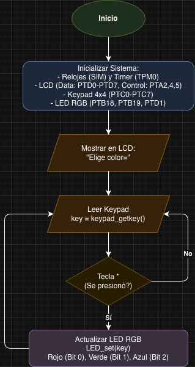
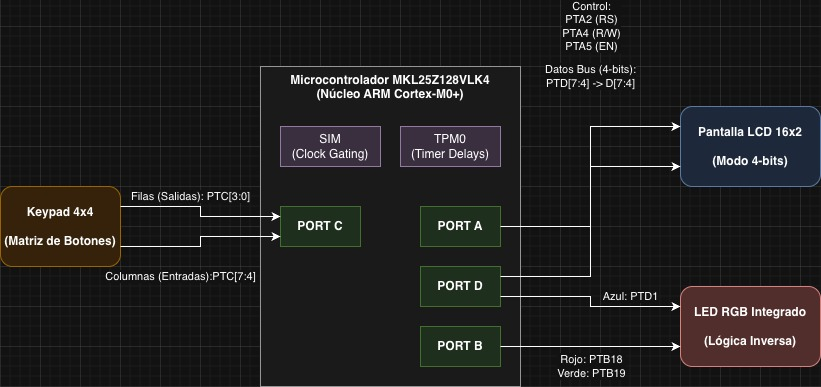

# SoC Practice 1: RGB LED Control with User Interface
## Andre - Santi - Jared - Joshua

This project consists of the design and implementation of an embedded system that allows the user to dynamically select the color of an RGB LED. Interaction is handled through a menu displayed on an LCD screen, and navigation is controlled using a matrix keypad.

## Materials Used

To replicate this project, the following hardware is required:

* **Development Board:** NXP FRDM-KL25Z.
* **Display:** Alphanumeric LCD (commonly 16x2) with a generic controller (Operating in **4-bit mode**).
* **Input:** 4x4 Matrix Keypad.
* **Output:** RGB LED (using the onboard LED of the FRDM-KL25Z board).
* **Extra Components:** Breadboard, jumper wires, and resistors (if using an external RGB LED module).

## System Features

* **Interactive Menu:** Options are displayed directly on the LCD screen with optimized screen-refreshing to prevent visual flickering (anti-flickering).
* **Keypad Reading:** Scanning of a 4x4 keypad via rows and columns, including a software map that translates the physical hardware matrix into actual sequential numeric values.
* **Color Variety:** Support for 8 different states on the RGB LED: Red, Green, Blue, Yellow, Cyan, Magenta, White, and Off.
* **Resource Optimization (4-Bits):** The design is strictly restricted to using a maximum of 16 GPIO pins on the board. To achieve this and avoid hardware pin collisions, the LCD screen was configured to operate by sending data in 4-bit "nibbles".

## Architecture and Pin Mapping

According to the source code optimized for 4-bit mode, the GPIO port distribution is as follows:

### Matrix Keypad - Port C
The keypad uses 8 pins from Port C, initially configured as inputs with internal pull-up resistors activated.
* **Rows (Dynamic Outputs):** `PTC0`, `PTC1`, `PTC2`, `PTC3`
* **Columns (Static Inputs):** `PTC4`, `PTC5`, `PTC6`, `PTC7`

### LCD Screen - Ports A and D (4-Bit Mode)
To avoid logic conflicts with the Blue LED (`PTD1`), the LCD data bus was reduced to 4 bits, utilizing exclusively the upper half of Port D.
* **Data Bus (4 bits):** `PTD4`, `PTD5`, `PTD6`, `PTD7` *(Pins D0 through D3 on the physical screen are left disconnected)*.
* **Control Pins:**
    * **RS (Register Select):** `PTA2`
    * **R/W (Read/Write):** `PTA4`
    * **EN (Enable):** `PTA5`

### RGB LED - Ports B and D
The pins connected to the onboard RGB LED of the FRDM-KL25Z board are used (operating with inverse logic / common cathode on the board's circuit):
* **Red:** `PTB18`
* **Green:** `PTB19`
* **Blue:** `PTD1` *(Safely isolated from the LCD data bus)*

## Execution Flow

1.  **Initialization:** Configuration of clocks (SIM), software delays, setting the LCD to 4-bit mode, the keypad, and the RGB LED pins.
2.  **Start Screen:** The message `"Elige color:"` (Choose color) is displayed on the LCD to instruct the user.
3.  **Main Loop:** The microcontroller enters an infinite loop, constantly scanning the matrix keypad (*polling*).
4.  **Update:** When a valid, new key is pressed, the system matches the value to modify the state of the RGB LED output pins in real-time, and clears/refreshes only the second line of the LCD to display the corresponding color name.

## System Flowchart ( Spanish )

Below is the flowchart illustrating the main execution logic, the keypad scanning loop, and the LED/LCD update process.

