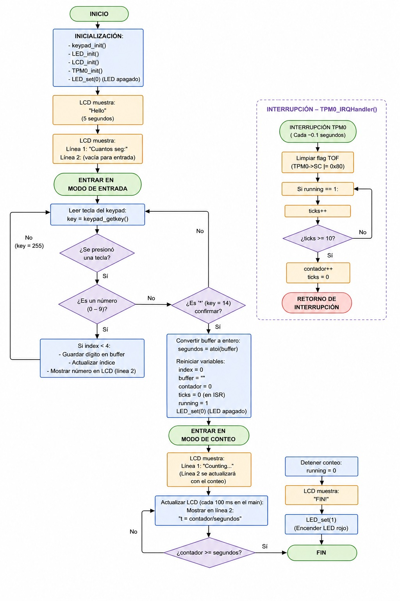
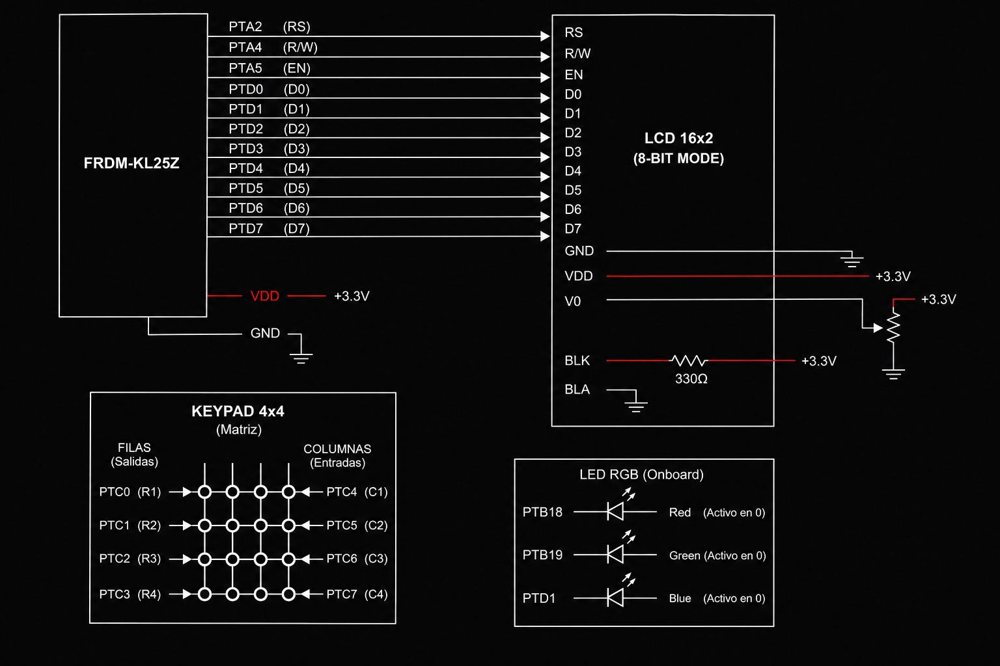

# SoC Practice: Ascending Timer with Keypad, LCD and TPM0  
Andre - Santi - Jared - Joshua

This project implements an embedded system divided into two main stages:

- **Part 1:** User interface and output control using keypad, LCD, and RGB LED  
- **Part 2:** Ascending timer using TPM0 interrupts with real-time LCD display  

---

## Materials Used

To replicate this project, the following hardware is required:

- Microcontroller: KL25Z  
- Display: LCD (16x2) operating in 8-bit mode  
- Input Device: 4x4 Matrix Keypad  
- Output Device: RGB LED (or single LED)  
- Extra Components: Breadboard, jumper wires  

---

# 🔹 PART 1: Menu and Output Management

## Description

In this stage, the system implements a simple user interface using the keypad and LCD. The user selects a color, and the corresponding LED is activated.

---

## System Features (Part 1)

- Menu displayed on LCD  
- Keypad-based selection  
- RGB LED control  
- Immediate visual feedback  

---

## Execution Flow (Part 1)

### Initialization
- Initialize keypad, LCD, and LED  

---

### Menu Display
- LCD shows:
- PRESS BUTTON
-R:1 B:2 G:3

---

### User Input
- System waits for key press  
- Valid inputs:
- `1` → Red LED  
- `2` → Blue LED  
- `3` → Green LED  

---

### LED Activation
- LCD displays selected color  
- Corresponding LED turns ON  
- System waits 3 seconds  
- LED turns OFF  
- Returns to menu  

---

## System Behavior (Part 1)

- System runs in a loop  
- Only one LED is active at a time  
- User interaction is simple and immediate  

---

# 🔹 PART 2: Ascending Timer with TPM0

## Description

This stage expands the system by allowing the user to configure a timer using the keypad. The timer runs using hardware interrupts and displays real-time progress on the LCD.

---

## System Features (Part 2)

- User Input via Keypad (multi-digit)  
- Dynamic Timer Configuration  
- Interrupt-Based Timing using TPM0  
- Real-Time LCD Display  
- LED indicator when timer finishes  

---

## Architecture and Pin Mapping

### Keypad - Port C
- Rows (Outputs): PTC0 – PTC3  
- Columns (Inputs): PTC4 – PTC7  
- Configured using scanning method  

### LCD Screen - Ports A and D (8-Bit Mode)
- Data Bus: PTD0 – PTD7  
- Control Pins:  
- RS: PTA2  
- RW: PTA4  
- EN: PTA5  

### RGB LED
- Red: PTB18  
- Green: PTB19  
- Blue: PTD1  

### Timer Module
- TPM0: Generates periodic interrupts (~0.1 s base)  
- Internal logic accumulates to achieve 1-second timing  

---

## Execution Flow (Part 2)

### Initialization
- Initialize keypad, LCD, LED, and TPM0  
- Display "Hello" for 5 seconds  
- Prompt user with "Cuantos seg:"  

---

### User Input
- User enters digits using keypad  
- Values stored in buffer  
- Input confirmed with `*`  

---

### Timer Start
- Convert input to integer  
- Reset variables  
- Start timer (running = 1)  
- Display "Counting..."  

---

### Main Loop
- Continuously scans keypad  
- If running:
- Displays current time vs total  
- Updates LCD every cycle  

---

### Timer Interrupt (TPM0)
- Executes every ~0.1 s  
- Accumulates ticks  
- Every 1 second:
- Increments counter  

---

### Timer Completion
- When contador >= segundos:
- Timer stops  
- LCD displays "FIN!"  
- LED turns ON  

---

## System Behavior (Part 2)

- User defines timer duration  
- System counts in real time  
- LCD shows progress (`t = actual / total`)  
- LED indicates completion  

---
# Diagrams pt 1

## Diagrama de flujo

## Diagrama de conexión

# Diagrams pt 2

## Diagrama de flujo

## Diagrama de conexión

