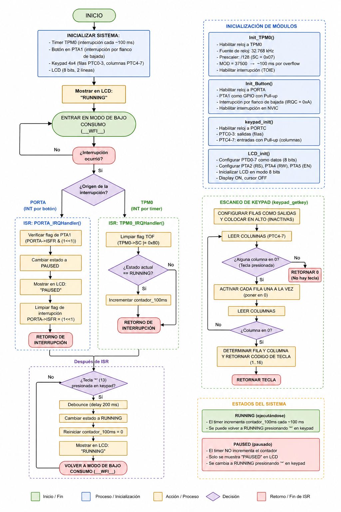
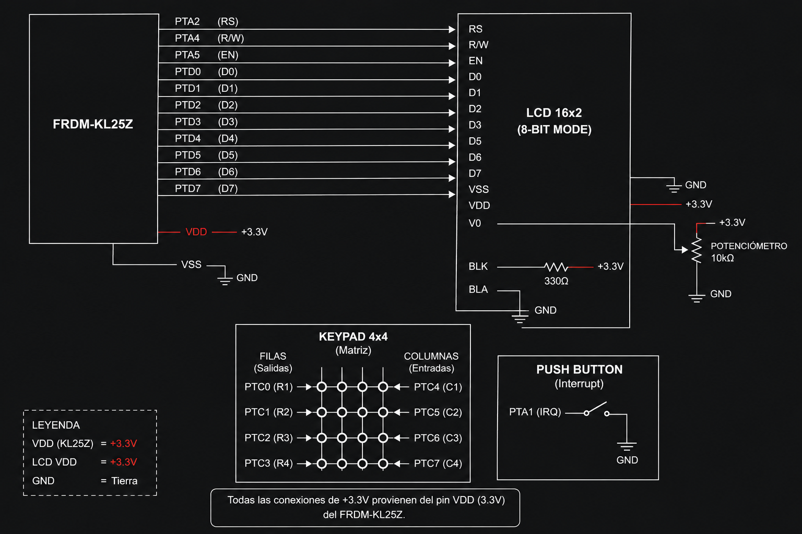

# SoC Practice: Interrupts, Timer Control and State Management  
Andre - Santi - Jared - Joshua  

This project explores the use of **hardware interrupts, timers (TPM0), and user interaction** in an embedded system using the KL25Z microcontroller.  

The project is divided into **three progressive parts**, each adding more complexity and system control.

---

##  Materials Used

- Microcontroller: KL25Z  
- Push Buttons (Switches)  
- RGB LED (Red, Green, Blue)  
- LCD (16x2, 8-bit mode)  
- 4x4 Matrix Keypad  
- Breadboard and jumper wires  

---

# 🔹 PART 1: Interrupt from a Switch

## Description

This part introduces **basic interrupt handling** using a push button connected to **PORTA (PTA1)**.

The system continuously runs a background task while waiting for an interrupt event.

---

## System Behavior

- The **main loop toggles the RED LED continuously**  
- When the button (PTA1) is pressed:
  - An interrupt is triggered  
  - The **GREEN LED blinks 3 times**  

---

## Key Concepts

- GPIO configuration  
- External interrupts (falling edge trigger)  
- Interrupt Service Routine (ISR)  
- Timer-based delay using TPM0  

---

## Execution Flow

### Main Loop
- Toggle RED LED every 500 ms  

### Interrupt (PORTA_IRQHandler)
- Detect falling edge on PTA1  
- Blink GREEN LED 3 times  
- Clear interrupt flag  

---

# 🔹 PART 2: Multiple Interrupt Requests

## Description

This part extends the system to handle **multiple interrupt sources from the same port (PORTA)**.

Two buttons are used:
- PTA1 → Green LED  
- PTA2 → Blue LED  

---

## System Behavior

- Main loop continues toggling RED LED  
- When a button is pressed:
  - PTA1 → GREEN LED blinks 3 times  
  - PTA2 → BLUE LED blinks 3 times  

---

## Key Concepts

- Handling multiple interrupt flags  
- Shared interrupt vector (PORTA)  
- Interrupt flag checking using ISFR  
- NVIC configuration  

---

## Execution Flow

### Main Loop
- Toggle RED LED continuously  

### Interrupt (PORTA_IRQHandler)
- Check which pin triggered the interrupt:
  - If PTA1 → blink GREEN LED  
  - If PTA2 → blink BLUE LED  
- Clear corresponding interrupt flag  

---

# 🔹 PART 3: Timer + Interrupt + State Machine

## Description

This part integrates:
- Timer interrupts (TPM0)  
- External interrupts (button)  
- Keypad input  
- LCD display  

The system now behaves like a **state machine** with two modes:
- RUNNING  
- PAUSED  

---

## System Features

- LCD displays current system state  
- Keypad allows user interaction  
- Button interrupt pauses the system  
- Timer interrupt updates internal counter  

---

## System Behavior

- System starts in **RUNNING** state  
- LCD displays `"RUNNING"`  
- TPM0 generates periodic interrupts (~100 ms)  
- Counter increases only when running  

### User Interaction

- Press `*` (keypad):
  - System resets  
  - Returns to RUNNING  
  - Counter resets  

- Press button (PTA1):
  - Interrupt triggers  
  - System changes to **PAUSED**  
  - LCD displays `"PAUSED"`  

---

## Key Concepts

- State machines in embedded systems  
- Timer interrupts (TPM0)  
- Combining polling (keypad) + interrupts  
- LCD interfacing in 8-bit mode  

---

## Execution Flow

### Initialization
- Initialize TPM0  
- Initialize button interrupt (PORTA)  
- Initialize keypad and LCD  

---

### Main Loop
- Scan keypad input  
- If `*` pressed:
  - Reset system  
  - Set state to RUNNING  

---

### Timer Interrupt (TPM0_IRQHandler)
- Executes periodically  
- If state == RUNNING:
  - Increment counter  

---

### Button Interrupt (PORTA_IRQHandler)
- Change state to PAUSED  
- Update LCD display  

---

## Overall System Behavior

| Component | Function |
|----------|--------|
| TPM0 | Generates periodic interrupts |
| PORTA | Handles external button interrupts |
| Keypad | User input (reset system) |
| LCD | Displays system state |
| LEDs | Visual feedback |

---

##  Final Insight

This project demonstrates how embedded systems evolve from:

1. **Simple interrupt handling**  
2. **Multiple interrupt management**  
3. **Full system integration with states and user interface**  

It highlights the importance of combining:
- Interrupts  
- Timers  
- Polling  
- State machines  

to build responsive and efficient embedded applications.

# Diagrams pt 1

## Diagrama de flujo

## Diagrama de conexión

